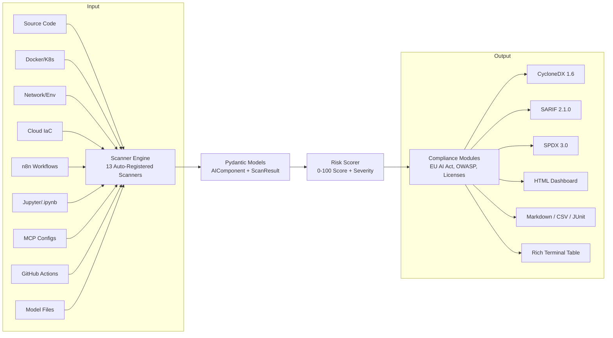

<div align="center">
  
  
  <h1>AI-BOM</h1>
  <p><strong>Discover every AI agent, model, and API hiding in your infrastructure</strong></p>

  <!-- badges -->
  <p>
    <a href="https://github.com/Trusera/ai-bom/stargazers"></a>
    <a href="https://pypi.org/project/ai-bom/"></a>
    <a href="https://pypi.org/project/ai-bom/"></a>
    <a href="https://www.npmjs.com/package/n8n-nodes-trusera"></a>
    <a href="https://pypi.org/project/trusera-sdk/"></a>
    <a href="https://www.npmjs.com/package/trusera-sdk"></a>
    
    
    
    
    <a href="https://codecov.io/gh/Trusera/ai-bom"></a>
    
  </p>
  <h2 align="center">🎬 Demo</h2>

  <p align="center">
    
  </p>

  <p>
    <a href="#quick-start">Quick Start</a> &nbsp;|&nbsp;
    <a href="#agent-sdks">Agent SDKs</a> &nbsp;|&nbsp;
    <a href="#standalone-vs-platform">Standalone vs Platform</a> &nbsp;|&nbsp;
    <a href="#n8n-community-node">n8n Node</a> &nbsp;|&nbsp;
    <a href="#what-it-finds">What It Finds</a> &nbsp;|&nbsp;
    <a href="#comparison">Comparison</a> &nbsp;|&nbsp;
    <a href="#architecture">Architecture</a> &nbsp;|&nbsp;
    <a href="#output-formats">Output Formats</a> &nbsp;|&nbsp;
    <a href="#cicd-integration">CI/CD</a> &nbsp;|&nbsp;
    <a href="#cedar-policy-gate">Cedar Policy</a> &nbsp;|&nbsp;
    <a href="#vs-code-extension">VS Code</a> &nbsp;|&nbsp;
    <a href="#scan-levels">Scan Levels</a> &nbsp;|&nbsp;
    <a href="#dashboard">Dashboard</a>
  </p>

  <br />
  
  <br />
  <sub>Scan all your n8n AI workflows for security risks — directly inside n8n</sub>
</div>

---

## Why AI-BOM?

- **EU AI Act (Article 53, Aug 2025)** requires a complete AI component inventory. No existing SBOM tool covers AI.
- **60%+ of AI usage is undocumented** — shadow AI is the new shadow IT. Developers ship LLM integrations, agent frameworks, and MCP servers without security review.
- **First tool to scan n8n workflows for AI** — n8n is the backbone of enterprise AI automation, but completely invisible to Trivy, Syft, and Grype.

One command. 13 scanners. 9 output formats. Standards-compliant AI Bill of Materials.

## Quick Start

```bash
pipx install ai-bom
ai-bom scan .
```

That's it. Scans your project and prints a risk-scored inventory of every AI component found.

```bash
# CycloneDX SBOM for compliance
ai-bom scan . -f cyclonedx -o ai-bom.cdx.json

# SARIF for GitHub Code Scanning
ai-bom scan . -f sarif -o results.sarif

# Fail CI on critical findings
ai-bom scan . --fail-on critical --quiet
```

<details>
<summary>Alternative: Install in a virtual environment</summary>

```bash
python3 -m venv .venv && source .venv/bin/activate
pip install ai-bom
ai-bom scan .
```

</details>

<details>
<summary>Troubleshooting: PEP 668 / "externally-managed-environment" error</summary>

Modern Linux distros (Ubuntu 24.04+) and macOS 14+ block `pip install` at the system level. Use **pipx** (recommended) or a **venv** as shown above.

```bash
sudo apt install pipx   # Debian/Ubuntu
brew install pipx        # macOS
pipx install ai-bom
```

</details>

<details>
<summary>Alternative: Run with Docker</summary>

```bash
docker run --rm -v $(pwd):/scan ghcr.io/trusera/ai-bom scan /scan

# CycloneDX output
docker run --rm -v $(pwd):/scan ghcr.io/trusera/ai-bom scan /scan -f cyclonedx -o /scan/ai-bom.cdx.json

# JSON output piped to jq
docker run --rm -v $(pwd):/scan ghcr.io/trusera/ai-bom scan /scan --json | jq '.components[] | select(.properties[]? | select(.name == "trusera:risk_score" and (.value | tonumber) > 7))'
```

The image is published to `ghcr.io/trusera/ai-bom` on every tagged release.

</details>

## Agent SDKs

Runtime monitoring SDKs for AI agents — intercept HTTP calls, evaluate Cedar policies, and track events in real time.

| Language | Package | Install |
|----------|---------|---------|
| **Python** | [`trusera-sdk`](https://pypi.org/project/trusera-sdk/) | `pip install trusera-sdk` |
| **TypeScript** | [`trusera-sdk`](https://www.npmjs.com/package/trusera-sdk) | `npm install trusera-sdk` |
| **Go** | [`trusera-sdk-go`](trusera-sdk-go/) | `go get github.com/Trusera/ai-bom/trusera-sdk-go` |

```python
# Python — 3 lines to monitor any agent
from trusera_sdk import TruseraClient

client = TruseraClient(api_key="tsk_...", agent_id="my-agent")
client.track_event("llm_call", {"model": "gpt-4o", "tokens": 150})
```

```typescript
// TypeScript — transparent HTTP interception
import { TruseraClient, TruseraInterceptor } from "trusera-sdk";

const client = new TruseraClient({ apiKey: "tsk_..." });
const interceptor = new TruseraInterceptor();
interceptor.install(client, { enforcement: "warn" });
// All fetch() calls are now monitored
```

### Standalone Mode (No API Key Required)

All SDKs work **without** a Trusera account — local Cedar policy enforcement + JSONL event logging:

```python
# Python — standalone, zero platform dependency
from trusera_sdk import StandaloneInterceptor

with StandaloneInterceptor(
    policy_file=".cedar/ai-policy.cedar",
    enforcement="block",
    log_file="agent-events.jsonl",
):
    # All HTTP calls are now policy-checked and logged locally
    agent.run()
```

```typescript
// TypeScript — standalone mode
import { StandaloneInterceptor } from "trusera-sdk";

const interceptor = new StandaloneInterceptor({
  policyFile: ".cedar/ai-policy.cedar",
  enforcement: "block",
  logFile: "agent-events.jsonl",
});
interceptor.install();
// All fetch() calls are now policy-checked and logged locally
```

```go
// Go — standalone mode
interceptor, _ := trusera.NewStandaloneInterceptor(
    trusera.WithPolicyFile("policy.cedar"),
    trusera.WithEnforcement(trusera.EnforcementBlock),
    trusera.WithLogFile("events.jsonl"),
)
defer interceptor.Close()
httpClient := interceptor.WrapClient(http.DefaultClient)
```

### Standalone vs Platform

| Feature | Standalone (free, open source) | Platform (paid) |
|---------|-------------------------------|-----------------|
| Scan codebases for AI components | Yes | Yes |
| Cedar policy gates in CI/CD | Yes | Yes |
| VS Code extension | Yes | Yes |
| n8n workflow scanning | Yes | Yes |
| Runtime HTTP interception | Yes | Yes |
| Local policy enforcement | Yes | Yes |
| Local JSONL event logging | Yes | Yes |
| Centralized dashboard | — | Yes |
| Team collaboration & RBAC | — | Yes |
| Alerts (Slack, Jira, SIEM) | — | Yes |
| Historical trends & analytics | — | Yes |
| Compliance reports (EU AI Act) | — | Yes |
| SSO & API key management | — | Yes |

**Framework integrations:** LangChain, CrewAI, AutoGen (Python) | LangChain.js (TypeScript)

See [docs/interceptor-sdks.md](docs/interceptor-sdks.md) for the full guide.

## n8n Community Node

Scan all your n8n workflows for AI security risks — directly inside n8n. One node, full dashboard.

**Install:** Settings > Community Nodes > `n8n-nodes-trusera`

### Setup (1 minute)

1. Add the **Trusera Webhook** node to a workflow
2. Add your n8n API credential (Settings > n8n API > Create API Key)
3. Activate the workflow
4. Visit `http://your-n8n-url/webhook/trusera`

That's it. The node fetches all workflows, scans them, and serves an interactive HTML dashboard.

### Included Nodes

| Node | Purpose |
|------|---------|
| **Trusera Webhook** | One-node dashboard at `/webhook/trusera` (recommended) |
| **Trusera Dashboard** | Chain with built-in Webhook for custom setups |
| **Trusera Scan** | Programmatic scanning — returns JSON for CI/CD pipelines |
| **Trusera Policy** | Security gates — pass/fail against configurable policies |
| **Trusera Report** | Markdown/JSON reports for Slack, email, or docs |

### Dashboard features

- Severity distribution charts, component type breakdown, and OWASP LLM Top 10 mapping
- Scanned workflows table with trigger type, component count, and risk severity
- Sortable findings table with search, severity/type/workflow filters
- Per-finding remediation cards with actionable fix steps
- CSV and JSON export
- Light/dark theme toggle
- Optional password protection (AES-256-GCM encrypted, client-side decryption)

## What It Finds

| Category | Examples | Scanner |
|----------|----------|---------|
| LLM Providers | OpenAI, Anthropic, Google AI, Mistral, Cohere, Ollama, DeepSeek | Code |
| Agent Frameworks | LangChain, CrewAI, AutoGen, LlamaIndex, LangGraph | Code |
| Model References | gpt-4o, claude-3-5-sonnet, gemini-1.5-pro, llama-3 | Code |
| API Keys | OpenAI (sk-\*), Anthropic (sk-ant-\*), HuggingFace (hf\_\*) | Code, Network |
| AI Containers | Ollama, vLLM, HuggingFace TGI, NVIDIA Triton, ChromaDB | Docker |
| Cloud AI | AWS Bedrock/SageMaker \| Azure OpenAI/ML \| Google Vertex AI | Cloud |
| AI Endpoints | api.openai.com, api.anthropic.com, localhost:11434 | Network |
| n8n AI Nodes | AI Agents, LLM Chat, MCP Client, Tools, Embeddings | n8n |
| MCP Servers | Model Context Protocol server configurations | Code, MCP Config |
| A2A Protocol | Google Agent-to-Agent protocol | Code |
| CrewAI Flows | @crew, @agent, @task, @flow decorators | Code, AST |
| Jupyter Notebooks | AI imports and model usage in .ipynb files | Jupyter |
| GitHub Actions | AI-related actions and model deployments | GitHub Actions |
| Model Files | .gguf, .safetensors, .onnx, .pt binary model files | Model File |

**25+ AI SDKs detected** across Python, JavaScript, TypeScript, Java, Go, Rust, and Ruby.

## Comparison

How does ai-bom compare to existing supply chain security tools?

| Feature | ai-bom | Trivy | Syft | Grype |
|---------|--------|-------|------|-------|
| AI/LLM SDK detection | **Yes** | No | No | No |
| AI model references | **Yes** | No | No | No |
| Agent framework detection | **Yes** | No | No | No |
| n8n workflow scanning | **Yes** | No | No | No |
| MCP server detection | **Yes** | No | No | No |
| AI-specific risk scoring | **Yes** | No | No | No |
| Cloud AI service detection | **Yes** | No | No | No |
| Jupyter notebook scanning | **Yes** | No | No | No |
| CycloneDX SBOM output | **Yes** | Yes | Yes | No |
| SARIF output (GitHub) | **Yes** | Yes | No | No |
| Docker AI container detection | **Yes** | Partial | Partial | No |
| CVE vulnerability scanning | No | Yes | No | Yes |
| OS package scanning | No | Yes | Yes | Yes |

> **ai-bom doesn't replace Trivy or Syft — it fills the AI-shaped gap they leave behind.**

## Architecture



**Key design decisions:**
- Scanners auto-register via `__init_subclass__` — add a new scanner in one file, zero wiring
- Regex-based detection (not AST by default) for speed and cross-language support
- CycloneDX 1.6 JSON generated directly from dicts — no heavy dependencies
- Risk scoring is a pure stateless function
- Parallel scanner execution via thread pool

## Output Formats

### Table (default)

```bash
ai-bom scan .
```

Rich terminal output with color-coded severity, risk scores, and component grouping.

### CycloneDX 1.6

```bash
ai-bom scan . -f cyclonedx -o ai-bom.cdx.json
```

Industry-standard SBOM format. Compatible with OWASP Dependency-Track. Includes Trusera AI risk properties.

<details>
<summary>Example output snippet</summary>

```json
{
  "bomFormat": "CycloneDX",
  "specVersion": "1.6",
  "components": [
    {
      "type": "library",
      "name": "openai",
      "version": "1.x",
      "properties": [
        { "name": "trusera:ai-bom:risk-score", "value": "45" },
        { "name": "trusera:ai-bom:severity", "value": "medium" }
      ]
    }
  ]
}
```

</details>

### SARIF 2.1.0

```bash
ai-bom scan . -f sarif -o results.sarif
```

Upload to GitHub Code Scanning for inline annotations on AI components.

### Other formats

| Format | Flag | Use case |
|--------|------|----------|
| HTML | `-f html` | Shareable dashboard — no server required |
| Markdown | `-f markdown` | PR comments, documentation |
| SPDX 3.0 | `-f spdx3` | SPDX-compatible with AI extensions |
| CSV | `-f csv` | Spreadsheet analysis |
| JUnit | `-f junit` | CI/CD test reporting |
| JSON | `-f json` | Alias for CycloneDX |

## CI/CD Integration

### GitHub Actions (recommended)

Use the official AI-BOM GitHub Action for one-line CI/CD integration:

```yaml
name: AI-BOM Scan
on: [push, pull_request]
permissions:
  security-events: write
  contents: read

jobs:
  ai-bom:
    runs-on: ubuntu-latest
    steps:
      - uses: actions/checkout@v6

      - name: Scan for AI components
        uses: trusera/ai-bom@main
        with:
          format: sarif
          output: ai-bom-results.sarif
          fail-on: critical
          scan-level: deep
```

The action handles Python setup, ai-bom installation, and automatic SARIF upload to GitHub Code Scanning.

See [`.github/workflows/ai-bom-example.yml`](.github/workflows/ai-bom-example.yml) for more examples (CycloneDX SBOM, policy gates, artifact uploads).

<details>
<summary>Manual setup (without the action)</summary>

```yaml
name: AI-BOM Scan
on: [push, pull_request]

jobs:
  ai-bom:
    runs-on: ubuntu-latest
    steps:
      - uses: actions/checkout@v6

      - name: Install AI-BOM
        run: pipx install ai-bom

      - name: Scan for AI components
        run: ai-bom scan . --fail-on critical --quiet -f sarif -o results.sarif

      - name: Upload SARIF
        uses: github/codeql-action/upload-sarif@v4
        with:
          sarif_file: results.sarif
        if: always()
```

</details>

### GitLab CI

```yaml
include:
  - remote: 'https://raw.githubusercontent.com/Trusera/ai-bom/main/templates/gitlab-ci-ai-bom.yml'

variables:
  AI_BOM_FAIL_ON: "high"
  AI_BOM_DEEP_SCAN: "true"
```

See [templates/gitlab-ci-ai-bom.yml](templates/gitlab-ci-ai-bom.yml) for the full template.

### Policy enforcement

```bash
# Fail CI if any critical findings
ai-bom scan . --fail-on critical --quiet

# Use a YAML policy file for fine-grained control
ai-bom scan . --policy .ai-bom-policy.yml --quiet

# Cedar policy gate (see Cedar Policy Gate section)
python3 scripts/cedar-gate.py scan-results.json .cedar/ai-policy.cedar
```

```yaml
# .ai-bom-policy.yml
max_critical: 0
max_high: 5
max_risk_score: 75
block_providers: []
block_flags:
  - hardcoded_api_key
  - hardcoded_credentials
```

## Scan Levels

ai-bom's detection depth depends on the access available at scan time:

| Level | Access Required | What It Finds | Scanner |
|-------|----------------|---------------|---------|
| **L1 — File System** | Read-only file access | Source code imports, configs, IaC, n8n JSON, notebooks | Code, Cloud, n8n, Jupyter, MCP Config |
| **L2 — Docker** | + Docker socket | Running AI containers, GPU allocations | Docker |
| **L3 — Network** | + Env files | API endpoints, hardcoded keys, .env secrets | Network |
| **L4 — Cloud IaC** | + Terraform/CFN files | 60+ AWS/Azure/GCP AI resource types | Cloud |
| **L5 — Live Cloud** | + Cloud credentials | Managed AI services via cloud APIs | AWS/GCP/Azure Live |

```bash
# L1 (default) — works out of the box
ai-bom scan .

# L5 — live cloud scanning
pip install ai-bom[aws]
ai-bom scan-cloud aws
```

### Deep scanning (AST mode)

```bash
ai-bom scan . --deep
```

Enables Python AST analysis for decorator patterns (`@agent`, `@tool`, `@crew`, `@flow`), function calls to AI APIs, and string literals containing model names.

## Dashboard

```bash
pip install ai-bom[dashboard]

ai-bom scan . --save-dashboard   # Save scan results
ai-bom dashboard                  # Launch at http://127.0.0.1:8000
```

The web dashboard provides:
- Scan history with timestamps, targets, and component counts
- Drill-down into individual scans with sortable component tables
- Severity distribution charts and risk score visualizations
- Side-by-side scan comparison (diff view)

### n8n workflow scanning

```bash
# Scan workflow JSON files
ai-bom scan ./workflows/

# Scan local n8n installation
ai-bom scan . --n8n-local

# Scan running n8n instance via API
ai-bom scan . --n8n-url http://localhost:5678 --n8n-api-key YOUR_KEY
```

Detects AI Agent nodes, MCP client connections, webhook triggers without auth, dangerous tool combinations, and hardcoded credentials in workflow JSON.

## Cedar Policy Gate

Enforce fine-grained security rules on discovered AI components using Cedar-like policies. Fails the CI pipeline if any component violates a rule.

```cedar
// .cedar/ai-policy.cedar
forbid (principal, action, resource)
when { resource.severity == "critical" };

forbid (principal, action, resource)
when { resource.component_type == "api_key" };

permit (principal, action, resource);
```

```yaml
# GitHub Actions
- uses: trusera/ai-bom@main
  with:
    policy-gate: "true"
    cedar-policy-file: ".cedar/ai-policy.cedar"
```

Also available as a [GitLab CI template](templates/gitlab-ci-ai-bom.yml). See [docs/ci-integration.md](docs/ci-integration.md) for details.

## VS Code Extension

Scan your workspace for AI components directly from VS Code. Inline diagnostics, severity decorations, and a results tree view.

```
ext install trusera.ai-bom-scanner
```

The extension runs `ai-bom scan` on your workspace and displays findings as VS Code diagnostics with severity-based gutter decorations.

## Contributing

See [CONTRIBUTING.md](CONTRIBUTING.md) for development setup and guidelines.

```bash
git clone https://github.com/trusera/ai-bom.git && cd ai-bom
pip install -e ".[dev]"
pytest tests/ -v
```

Quality gates enforced:
- **ruff** (E,F,I,W,S,B,C4,UP,SIM,N,RUF) — zero lint errors
- **mypy** strict (`disallow_untyped_defs = true`) — zero type errors
- **pytest** — 651 tests, 80%+ coverage required

## License

Apache License 2.0 — see [LICENSE](LICENSE) for details.

---

## Star History

[](https://star-history.com/#Trusera/ai-bom&Date)

---

<div align="center">
  <strong>Built by <a href="https://trusera.dev">Trusera</a></strong> — Securing the Agentic Service Mesh
  <br />
  <sub>ai-bom is the open-source foundation of the Trusera platform for AI agent security.</sub>
</div>
